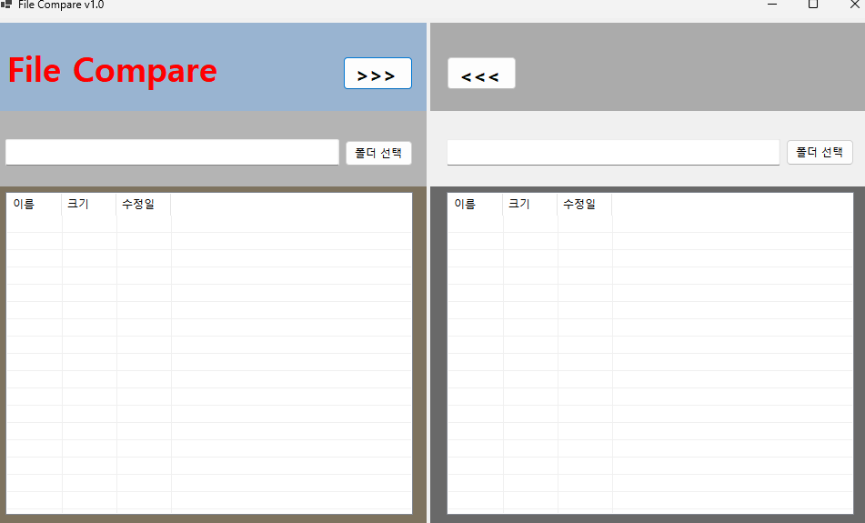
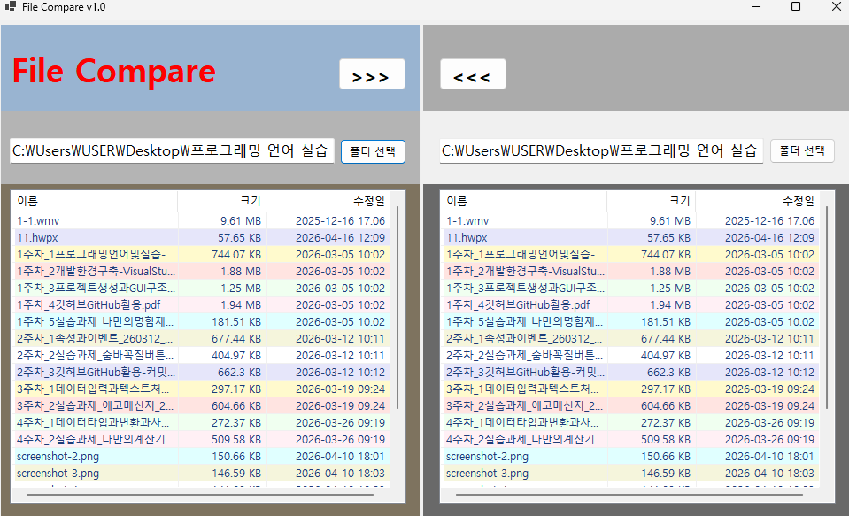
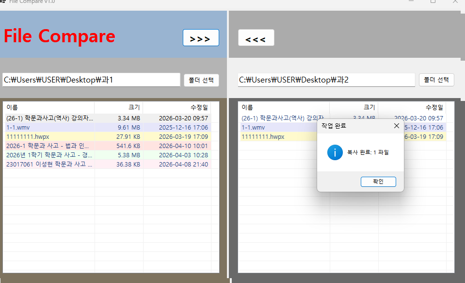
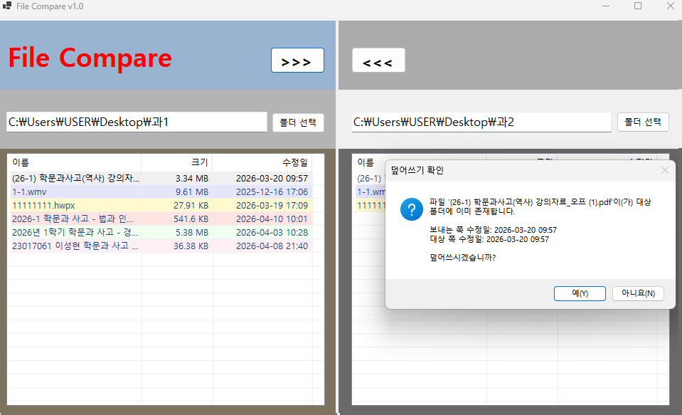
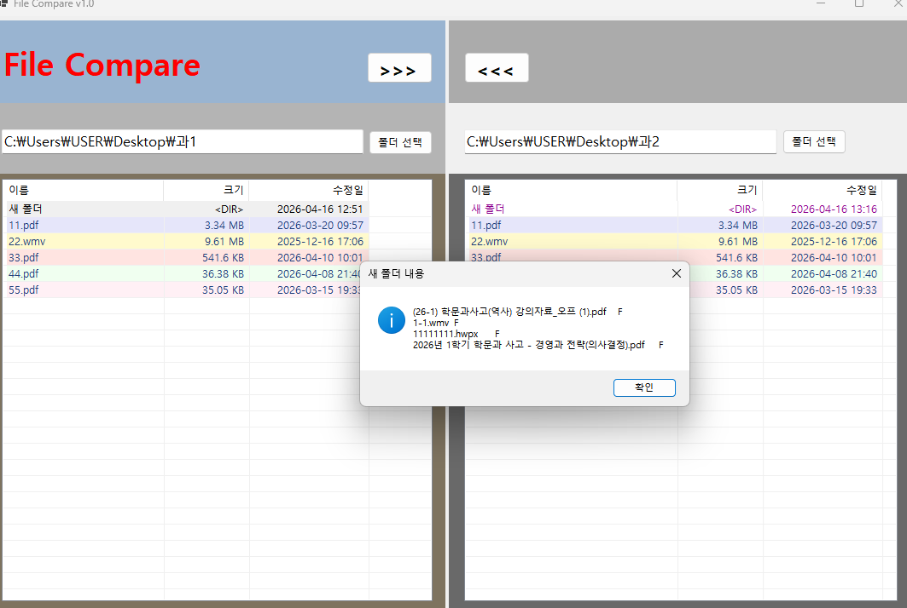

# (C# 코딩) FileCompare

## 개요
- C# 프로그래밍 학습
- 핵심기능 : 파일을 열어 비교하는 기능
- 사용한 플랫폼: -C#, .NET Windows Forms, Visual Studio, GitHub
- 사용한 컨트롤: -Button, OpenFileDialog, TextBox, Label

## 실행화면 (과제1)
-1단계 코드의 실행 스크린샷

컨트롤을 적절하게 배치하고 기본적인 속성을 설정하며, 각 컨트롤의 이름을 명확하게 지정하는 것을 목표로 한다. 
GUI를 설계한 후 이에 맞게 컨트롤을 배치하여 전체적인 UI를 구성한다. 
또한 각 컨트롤이 기본적으로 제공하는 기능이 정상적으로 동작하는지 확인하고, 
사용자가 메뉴를 다시 선택하여 주문할 수 있도록 모든 입력 및 선택 상태를 초기화하는 기능을 구현한다.

## 실행화면 (과제2)
-2단계 코드의 실행 스크린샷

폴더 선택 기능과 파일 리스트 표시 기능을 구현하고, 파일의 상태나 종류를 구분할 수 있도록 색상으로 구분하여 표시하는 것을 목표로 한다. 
사용자가 선택한 양쪽 폴더의 파일 목록을 각각 화면에 표시하여 두 폴더의 내용을 한눈에 비교할 수 있도록 구성한다.

## 실행화면 (과제3)
-3단계 코드의 실행 스크린샷

양쪽 폴더 사이에서 파일을 복사하는 기능을 구현하는 것을 목표로 한다. 
사용자가 선택한 파일을 반대쪽 폴더로 복사할 수 있도록 하고, 복사 과정에서 파일의 수정된 날짜 정보를 확인하여 
사용자에게 알린 뒤 '확인’을 받아 진행 여부를 결정하도록 구성한다.

## 실행화면 (과제4)
-4단계 코드의 실행 스크린샷

